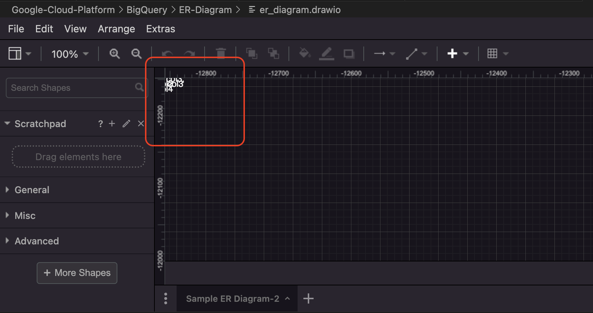
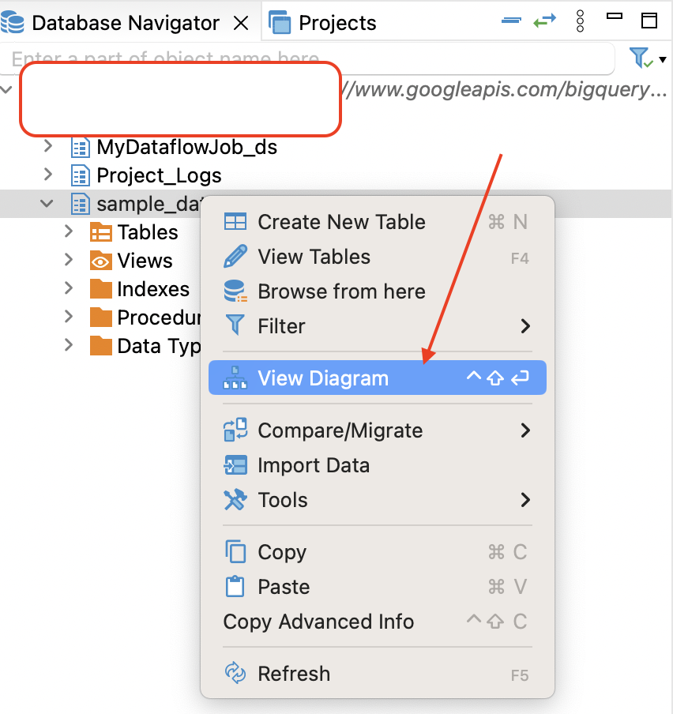

# Automated way to generate an ER diagram - VS Code + Big Query

Creating an automated way to generate an **ER diagram** (Entity-Relationship diagram) for all the tables in a `Google Cloud BigQuery dataset` and integrate this with the `draw.io` extension on VS Code involves several steps:

1. Accessing Google Cloud BigQuery dataset using Python or shell script.
2. Extracting table schema information (columns, data types, and relationships).
3. Generating the ER diagram from the extracted schema.
4. Exporting the diagram to a format compatible with draw.io.
5. Integrating the automated workflow into your development environment.

Here is a step-by-step guide to achieving this:

## Prerequisites:
1. **Google Cloud Project** and **BigQuery** Setup: Ensure that you have access to a Google Cloud project with BigQuery and appropriate permissions to read datasets.
2. **Python**: Install Python and necessary libraries (google-cloud-bigquery, pydot, etc.).
3. **draw.io Extension for VS Code**: Make sure you have the draw.io integration extension installed in VS Code.
4. **Google Cloud SDK**: Ensure the Google Cloud SDK (gcloud) is installed and authenticated.
5. **BigQuery Dataset**: You need a dataset in BigQuery that contains the tables you want to include in the ER diagram.


## Step 1: Set Up Python Environment
1. Install Required Python Libraries: You will need the following libraries to interact with BigQuery and generate the ER diagram:
```bash
pip install google-cloud-bigquery pydot
```
2. Authenticate with Google Cloud: Make sure your environment is authenticated to access Google Cloud services, either by setting the GOOGLE_APPLICATION_CREDENTIALS environment variable or using gcloud auth application-default login:
```bash
gcloud auth application-default login
```

## Step 2: Extract Table Schema from BigQuery
You need to use Python to query the schema of all tables in the BigQuery dataset. The BigQuery client library allows you to fetch this information.

[Refer Code](extract_table_schema.py)

This Python script will fetch all tables in a BigQuery dataset and list their columns.

## Step 3: Create an ER Diagram Using pydot
Once you've extracted the table schema, you can use a Python library like pydot to generate an ER diagram in a DOT format (which can be converted to a graphical diagram).

[Refer Code](generate_er_diagram.py)

## Step 4: Convert ER Diagram to Draw.io Format
draw.io supports importing files in **XML format**. To integrate this with the **draw.io extension** in VS Code, you need to convert the generated diagram into XML format.

Since `pydot` generates diagrams in DOT format, you can use a tool like `graphviz` to convert it to **SVG** or other formats that **draw.io** can understand. Alternatively, you can directly generate XML in a custom format.

## Step 5: Integration with VS Code (draw.io Extension)
1. Create a **Draw.io** Compatible XML File: You can manually convert the generated diagram to an XML format compatible with Draw.io, or you could write a script that directly generates the Draw.io XML format.

Here’s a very [basic template for an XML structure](./convert_to_xml_format.py) that could work with draw.io.

2. Upload the `er_diagram.drawio` to Draw.io: Once you've generated the er_diagram.drawio file, you can open it directly in the Draw.io extension in VS Code.

* In VS Code, use the Draw.io Integration extension.
* Open the er_diagram.drawio file.
* It will render the ER diagram, and you can edit it as needed.

## Step 6: Automating the Workflow with Shell Script (Optional)
If you prefer automating the entire process with a shell script, you can invoke the Python scripts from a shell and set up cron jobs or other automation tools to run them at regular intervals.

For example, create a shell script [generate_er_diagram.sh] that calls the Python script:

# Issue
Table Schema is located outside the visible canvas or at the very top of the diagram, making them difficult to see.

This issue could be due to the graph layout settings or the positioning of the tables within the Draw.io file.

Another observation, it seems that the coordinates are being placed in the negative range, which suggests that there may be an issue with the initial positioning or scaling of the Draw.io canvas.

`python sample_schema_to_er_2.py`




# Alternate Option: DBeaver
## How to Use DBeaver for Reverse Engineering ER Diagrams from BigQuery

DBeaver does provide better reverse-engineering features for ER Diagrams compared to dbt. While dbt focuses primarily on data transformations and modeling (without ER diagram generation), DBeaver is a comprehensive database management tool that supports schema reverse engineering to generate ER diagrams directly from existing database schemas.

1. Install DBeaver
First, download and install DBeaver from the [official website](https://dbeaver.io/download/)

Or use

`brew install --cask dbeaver-community`

2. Connect DBeaver to Google BigQuery
Open DBeaver and go to Database → New Database Connection → Search for BigQuery in the available data sources → Enter the connection details (make sure to have SA with appropriate Roles, and generate JSON Key).

3. Reverse Engineering ER Diagram
Once connected to BigQuery, navigate to your dataset in the Database Navigator window in DBeaver.

Right-click on the dataset or tables for which you want to generate the ER diagram.

Select Generate ER Diagram from the context menu. This will create an ER diagram based on the schema of the selected tables.

