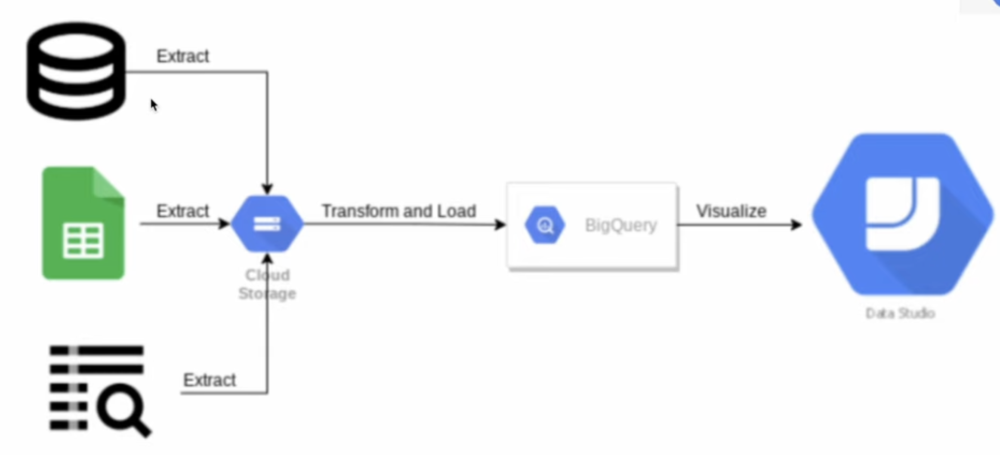
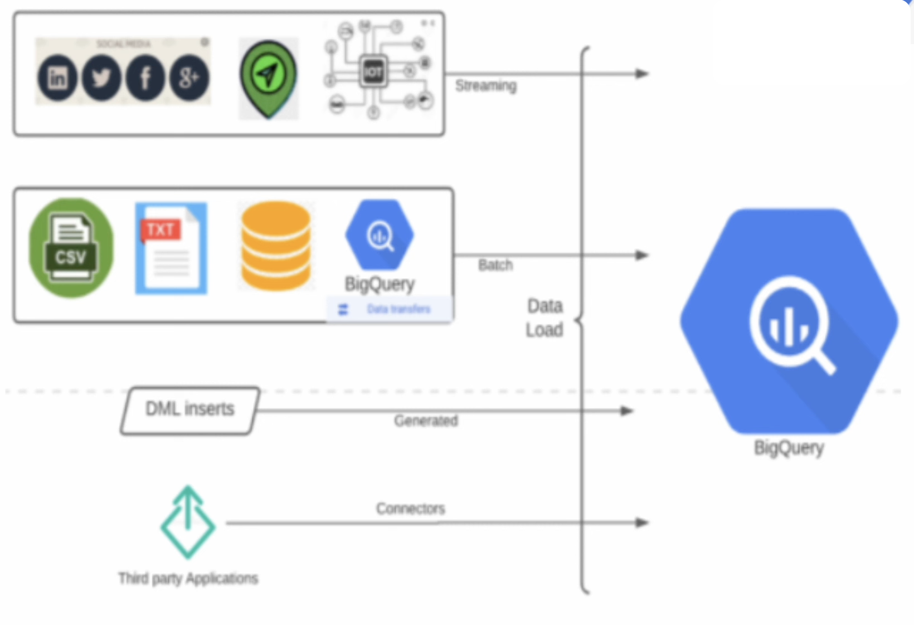

# What is BigQuery (BQ)?
1. BQ is google cloud's fully managed, petabyte-scale, and cost-effective analytics data warehouse.
2. Run analytics over large amount of data, batch and near real-time.
3. Supports batch and streaming loads.
4. No infrastructure to setuo and manage.
5. Interact primarily with SQL 2011 standard compliance.
6. Support structured and semi structured data.
7. Serverless & Auto scalable.
8. Biq Query runs blazing-fast SQL queries, powerful straming and Real-time analytics capability.
9. Completely focus on analyzing data to get meaningful insights, no administration required.
10. Easily and securely share insights within org. and beyond as datasets, queries, spreadsheets, and reports.
11. Build and operationalize machine learning solutions with SQL.
12. Data encryption by default and efficient access control mechanism.
13. Flexible pricing model, ondemain and flat rate.

# Permissions and Roles required to access BQ
1. BQ required roles and permissions managed by IAM.
2. Permissions can be granted to individual users, groups and service accounts.
3. Access can be granted to BQ on following hierarchy
    a. Organization or Google Cloud Project Level
    b. Dataset level
    c. Table or view level
4. Project and Dataset levell roles
    a. Viewer (dataset --> data viewer)
    b. Editor (dataset --> data Editor)
    c. Owner (dataset --> data Owner)

# Interacting with BQ
    > Web COnsole; Query Editor
    > Command Line (bq tool)
    > API Client Libraries.
        -- Provides programmatic access to BQ.
        --Query. load, export data
        -- Availabe on Jaba, Pythom, GO, C#, uby, Nide.js, PHP etc.

# Simple Data Warehouse Application

# Ways to Create a BQ Dataset and Tables
1. Web Console
2. SQL Commands.
    
        create schema demo_dataset_sql options (location='us-central1');

        create table demo_dataset_sql.sample_table 
        (
            year string,
            category string,
            value float64
        )
        OPTIONS(
            expiration_timestamp=TIMESTAMP "2024-12-30 00:00:00 UTC",
            description="a table to expire on 30 Dec 2024"
        );
3. CLI Commands
        
        bq --location=us-central1 mk \
        --dataset \
        --default_table_expiration=3600 \
        --description="demo dataset" \
        my_project_1234:demo_dataset_cli

        bq mk \
        --table \
        --expiration 3600 \
        --description "This is demo table" \
        demo_dataset_cli.my_sample_table \
        year:string,category:string,value:float64 

4. Programming Approach / API
    [script](/GCP/BigQuery/create_bq_dataset_table.py)        

# Load data into BQ - Different ways.
* Support different methods to load data into BQ.
* Batch load
    * Batch load supported file formats are
        * Avro
        * CSV
        * JSON        
        * ORC
    * Options to load data
        * GCP Console / Web Console (while creating a table, use option "create table from" > upload)
        * bg command line tool
                
                bg load \
                    --source_format=csv \
                    --skip_leading_rows=1 \
                    my-project-123:my_dataset.my_sample_table \
                    /home/dir_abc/my_sample_data_file.csv

        * Python BigQuery API
            [sample code]()
* Parquet 
* Streaming data load
* Generated data load
* Third party applications using connectors

