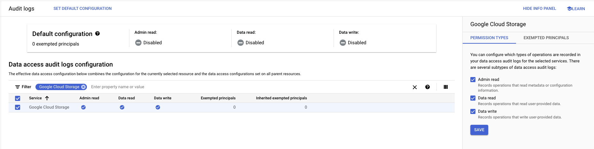
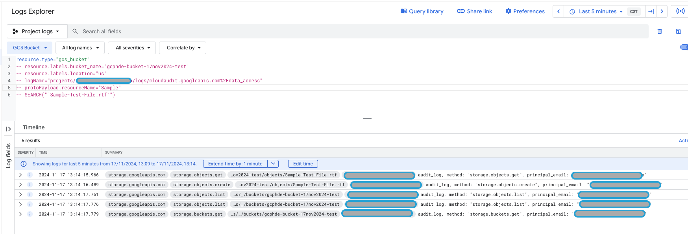
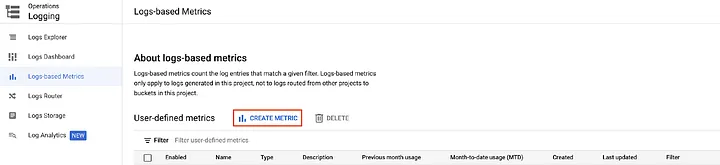
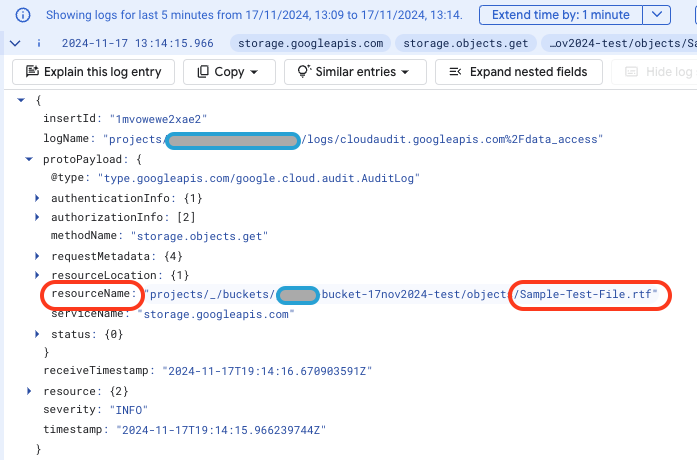
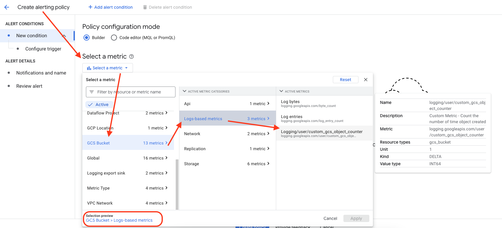
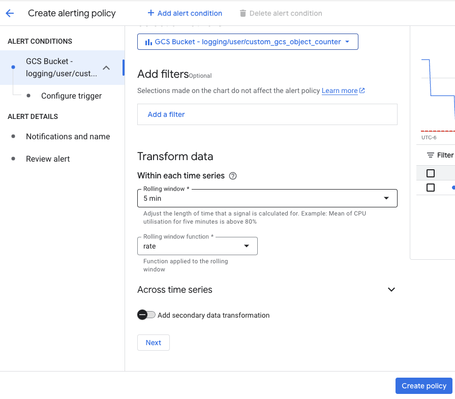

- [How to create a custom log-based metric and alert in GCP](#how-to-create-a-custom-log-based-metric-and-alert-in-gcp)
  - [Creating the Logs](#creating-the-logs)
  - [Creating the Metric](#creating-the-metric)
  - [Creating Alerts / Policy](#creating-alerts--policy)
    - [**Alert for file overwritten in any bucket**](#alert-for-file-overwritten-in-any-bucket)
    - [**Alert for file repeated in more than one bucket**](#alert-for-file-repeated-in-more-than-one-bucket)
  - [Final Thoughts](#final-thoughts)
  - [Conclusion](#conclusion)
- [How to check if audit log is enabled in google cloud](#how-to-check-if-audit-log-is-enabled-in-google-cloud)
- [Analysis of logs from BigQuery](#analysis-of-logs-from-bigquery)
  - [Log Sinks](#log-sinks)
  - [Important to know](#important-to-know)


# How to create a custom log-based metric and alert in GCP
**A walkthrough / tutorial**

Even though Google Cloud Platform's (GCP) Monitoring offers a variety of metrics from which to create alerts and dashboards, sometimes we need to create our alerts and monitors based on specific events that are not tracked by current metrics. A great way to achieve this is to create user-defined log-based metrics. These customizable metrics acquire data from Cloud Logging according to your specifications. GCP includes specific log-based metrics by default, but in this article, we will use the term to refer to user-defined metrics only.

In this walkthrough, we're going to see, step by step, how a log-based metric is defined. We'll start by performing an action that generates certain logs that we'll use as an example. We will then create a metric to track those logs, and we'll finish by creating two alerts as an example of how these metrics can be used. Our goal will be to create an alert that notifies when a given file has been overwritten multiple times in a short period and another for when the same file has been written to more than one bucket.

Most of this information is spread over several general-purpose GCP documentation pages, so it can take a lot of work to figure out how to achieve this task. Here, it will be summarized in one simple example.

This walkthrough assumes that you're already familiar with Logging, [LQL queries](https://cloud.google.com/logging/docs/view/logging-query-language), and Google Cloud Storage (GCS) and that you have some notion of the capabilities of GCP Monitoring. You don't need to be an expert, but you need to have some basic knowledge of GCP and a basic understanding of why you need this particular metric type. If you are seeking a solution for a customer or employer, you and your team should have considered using predefined metrics.

## Creating the Logs
For this example, you'll need to enable Data Access audit logs, as explained in the [official documentation](https://cloud.google.com/logging/docs/audit/configure-data-access#config-console-enable) or [How to enable Audit Logs](#how-to-check-if-audit-log-is-enabled-in-google-cloud). For more information on Data Access audit logs, [read this](https://cloud.google.com/logging/docs/audit#data-access).

**IAM Admin > Audit Logs >**


Afterward, create two buckets, and upload at least two files to each. Then, re-upload (overwrite) the same file a few times in each bucket. Make sure at least one of your files exists in both buckets. When you go to GCP Logging (StackDriver) and query all the logs coming from GCS Bucket as a resource type, you should be able to find logs of these uploads. You can also search for the filename of one of the files you've uploaded, which should fetch the audit logs for the repeated creation of that file. The image below shows one way of performing this search and a potential outcome. For now, we need to ensure we are generating **Data Access audit logs**. We'll go into more detail about these logs later.



I chose Data Access Audit Logs as an example because it creates log entries that contain much of the relevant information in a single string (see "resourceName" in the following image for an example) which will be helpful in the next section to show the flexibility of labels. It also provides a repetition that we can use to illustrate Counter metrics.

## Creating the Metric
We will go in-depth over how to create your metric from the GCP Console, but it is also possible to create metrics using gcloud commands, as shown in the [documentation](https://cloud.google.com/logging/docs/reference/tools/gcloud-logging#creating_advanced_metrics). However, for that process, you will have to create a JSON or YAML file that specifies the "LogMetric object", according to the official documentation, which requires an understanding of that file's contents. That will not be covered here.

1. To start, in the GCP Console, go to the navigation menu, then find the section "Operations", then Logging > Logs-based Metrics. You can also search for "Logs-based Metrics". On that page, click on "Create Metric":



2. Then, for the metric type, consider the following. The "Counter" type counts the number of log entries that match your criteria. On the other hand, the "Distribution" type groups log entries into histogram buckets and performs statistical calculations on them.

Counter metrics are useful when tracking the number of times something appears in your logs. Distribution metrics are better when you need to extract values like latencies, where an accumulated calculation is recorded at regular intervals. In this example, we're only going to send an alert when files get uploaded a certain amount of times. Therefore, we need to select the "Counter" metric type. For simplicity, we will only see this one example.

3. Add a name and description to your metric. Make it friendly and understandable for yourself and your co-workers, so you will know what this metric tracks when you see it again in the Cloud Monitoring pages.

4. In the "Filter selection" section, define the LQL query that will produce EXCLUSIVELY the log entries relevant to your use case. In this case, the logs that contain the name of the file that keeps getting overwritten:
```bash
resource.type="gcs_bucket"
protoPayload.methodName="storage.objects.create"
```

In this query, `resource.type` brings only logs from Cloud Storage buckets. Then, the query only brings logs from the method `storage.objects.create`, which is the method that refers to the creation of objects in a bucket, as the name suggests. If you have a different use case, keep in mind that you need to be specific enough with your query to avoid counting the same event more than once. For example, if we were NOT dealing with buckets, we could need to get the region from "resource.labels" (buckets don't need this because bucket names are globally unique). Click "Preview Logs" to check the exact results of your query.

Here's a sample of what the result looks like for the query above. The gray long bubbles show some of the most relevant keys. The first one is `serviceName`, related to `resource.type` from the query above; the second is `methodName`, and the third one is `resourceName`, like the sample in the previous section:


Notice that there are two different buckets in that result set. It isn't visible, but there are also three different file names. The following image shows the entire contents of an individual log entry:



1. In the next section, we need to add labels. Labels are how we define what data will be tracked by the metric. This data is stored in structures called "Time Series". You can think of each label as a variable in a struct or class. It's the different pieces of data that go into a data point.

In this case, let's add the following label. This first one does not have a Regular expression, and descriptions are optional. You can use whichever names you prefer, but we'll refer to these in this walkthrough:

```bash
+--------+--------+-----------------------------+
|  Name  |  Type  |         Field Name          |
+--------+--------+-----------------------------+
| Bucket | STRING | resource.labels.bucket_name |
+--------+--------+-----------------------------+
```

"Field Name" is the name of the field from which you will extract the data. "Type" is the data type. By keeping the Regular Expression empty, you will acquire the entire string from this field. This label allows us to distinguish which bucket the files are being uploaded to.

6. Add a new label with the name "FileName", type "STRING", and Field Name "protoPayload.resourceName". This one will extract the filenames. For the Regular Expression, add:
```bash
projects/_/buckets/[-.a-z0–9]+/objects/([.a-zA-Z0–9]+)
```

In this field, the capture group in parenthesis (only one allowed) is the text that will be extracted from the contents of protoPayload.resourceName. Notice from the sample above that the bucket is also available on the same field. If resource.labels.bucket_name didn't come in these logs, we could just create another label reading from the same field and change the capture group in this same RegEx to get the bucket's name.

You can also adjust the capture group to be more specific about the names of the files you want to track. For instance, instead of using

```bash
([.a-zA-Z0–9]+)
```

we could use the following to only track txt files.

```bash
([a-zA-Z0–9]+.txt)
```
Notice from the contents of the logs that the Project ID is available from resource.labels.project_id. We don't need to include that because a logs-based metric only applies to logs generated in its own given project, not to logs routed from other projects to buckets in this project.

7. Now you can click on "Create Metric". The new metric will be available within a couple of minutes.

8. When you create a metric, it will only start gathering data after the moment of its creation. If you were to look at the metric at this point in the Metrics Explorer, you would find that there is no data since metrics only capture logs generated after the metric's creation. For this reason, you will have to go back to your buckets and generate the logs again. If you want, you can check this metric afterward in the Metrics Explorer to verify that it is capturing your logs.

## Creating Alerts / Policy
Now that we've created a metric and logs, we can quickly create alerts following the GUI. You can also create alerts using [MQL](https://cloud.google.com/monitoring/mql), but that requires understanding that language and its options.

1. Ensure you have created the communication channel(s) you intend to use for these alerts. If not, you can configure them following the official documentation.
2. Go to `Monitoring > Alerting` in Cloud Console and click `CREATE POLICY`.
3. When selecting the metric, in the "Select a metric" box, look for the resource "GCS Bucket", then "Logs-based metrics", and the name of the metric you created in the previous section. Alternatively, search for the name of your metric in the Filter bar. If you can't find it, uncheck "Show only active resources & metrics" and search again in the inactive resources. This can be the case if you haven't generated the logs from the first section in a significant time. The image below shows where you will find the metric we created previously.



4. Do not add filters. They're suitable for removing log results from the metric's query when you cannot remove them in the LQL query, but that is not our case.

### **Alert for file overwritten in any bucket**

    The previous steps are how you start the creation of both Alerting Policies in this walkthrough. Now, we'll specifically add the configurations for alerting when a file has been uploaded more than twice to the same bucket.

   * For the Rolling window, select 5 or 10 minutes, so you have plenty of time to upload your files and generate the logs.
   * Open the collapsable section "Across time series". For both the Rolling Window Function and the Time Series Aggregation, select SUM. See the image below for what you should be seeing so far.



   * Under "Across time series", in the "Time Series Group By" box, add FileName and Bucket. This behaves like a GROUP BY statement in SQL. It allows you to group logs that have the same file and bucket, so you can perform your counts. The functions selected in the previous step will count how many log entries fit into each FileName and Bucket group. Click "NEXT".
  
   * In the "Configure alert trigger" section, select the following:
     * "Condition type": "Threshold"
     * "Alert trigger": "Any time series violates"
     * "Threshold position": "Above threshold"
     * "Threshold value": 2
   * In "Condition name", give the condition a name. For this example, we'll only use one, so it's not that important. However, this is useful when you want an alert that can be triggered in multiple different ways. You can create more conditions by clicking "Add Alert Condition" on the upper pane. When you're done, click "NEXT".
   * Make sure "Use notification channel" is ON, and select your notification channel(s).
   * Select a value for "Incident autoclose duration" and whether you want a notification when the incident is closed.
   * Normally, you want to add a label to indicate the severity level of the alert.
   * Give your alert policy a meaningful name and a meaningful message in the Documentation box at the end (this message will be sent with the alert to the notification channel, e.g. via e-mail, along with the labels). Click "NEXT".
   * Review the configurations on your alert policy (see image below). You can navigate through the options in the previous steps using the left pane in case you made a mistake. When you're ready, click "CREATE POLICY".

### **Alert for file repeated in more than one bucket**
The process is essentially the same as for the previous alert, except:

   * For both the Rolling Window Function and the Time Series Aggregation, select COUNT.
   * Under "Across time series", in the Time Series Group By box, add only the FileName. This way, the "Group By" will aggregate together the files regardless of the bucket. The functions selected in the previous step will count how many unique values there are for the different labels of the Time Series in the metric, grouped by FileName.
   * In the "Configure alert trigger" section, select the following:
     * "Condition type": "Threshold"
     * "Alert trigger": "Any time series violates"
     * "Threshold position": "Above threshold"
     * "Threshold value": 1
   * Follow the rest of the same process as the previous alert policy, giving this one its unique name, description, etc. The summary will look like the image below. Notice that only these settings have changed, and the chart looks completely different since now it is counting the number of buckets where each file name has been uploaded.

## Final Thoughts
As you may have noticed, for the Alerting Policy, GCP offers a lot of different Rolling Window functions and Time Series Aggregation functions. As of this writing, in the Metrics Explorer, these functions are referred to as "Aligner" and "Aggregator" functions respectively, because the terminology is being changed. Different combinations of these functions result in different calculations that can be used in different ways. For more information on what these data manipulations involve, check the official documentation [here](https://cloud.google.com/monitoring/api/v3/aggregation) and [here](https://cloud.google.com/monitoring/charts/metrics-selector#aggregation-option). If you need more details about what exactly each specific function is doing in the backend, you can find the descriptions [here](https://cloud.google.com/monitoring/api/ref_v3/rest/v3/projects.alertPolicies#aligner).

When creating your metrics, you can use either the Metrics Explorer or the page "Create alerting policy" to test your metric and play around with the Rolling Window and Time Series functions before settling on which labels you will create. Both pages show you a chart where you can see the data being output by the transformations you choose. When configuring the trigger for your Alerting Policy, the chart on the creation page also shows you a line indicating the threshold. You can also use these charts to visualize what happens with Rolling Windows of different sizes, groupings, and with other configurations of your choosing.

However, keep in mind that there are parts of a metric that cannot be changed once they have been created, and the same is true for alerting policies. Therefore, you will likely need to create multiple test metrics, followed by performing the action that creates the relevant logs, then check the Alert creation page or the Metrics Explorer to see the results. Then, you will need to repeat the process for every significant change you want to make.

## Conclusion
In this walkthrough, we have seen how to create a user-defined logs-based metric. We saw that you can choose different types of logs for this, with multiple complementary pieces of information that can be reused for different purposes.

We have also seen how you can create alerts based on those metrics, how they can perform different kinds of calculations from the data in said metric, and a few of the kinds of information that can be sent with the actual alerts.

Hopefully, this has given you a summary of the steps involved in creating a user-defined logs-based metric and alert, a general understanding of how they work, and references to the most relevant parts of the official documentation where you can find all the details that you need for your particular use-case.


# How to check if audit log is enabled in google cloud

To check if audit logs are enabled in Google Cloud, you can: 
1. Sign in to the Google Cloud Management Console 
2. Navigate to IAM & Admin > Audit Logs 
3. Select the Google Cloud project, folder, or organization you want to examine 
4. Check the log types, such as Admin Read, Data Read, and Data Write 
5. Check the exempted users listed in the Exempted principals column 

You can also use the Filter box to identify specific audit logs.


# Analysis of logs from BigQuery

On Google Cloud you can use [Log Analytics](https://cloud.google.com/logging/docs/log-analytics#analytics) to query and analyze your log data, and then you can view or [chart the query results](https://cloud.google.com/logging/docs/analyze/charts).

`BigQuery` is Google Cloud’s fully managed enterprise data warehouse that helps you manage and analyze your data with built-in features like machine learning, geospatial analysis, and business intelligence.

While BigQuery offers built-in observability capabilities like the `INFORMATION_SCHEMA` views, detailed logging remains crucial for in-depth usage analysis, auditing, and troubleshooting potential issues.

## Log Sinks
To send Google Cloud logs to BigQuery, you can create a sink that routes log entries to a BigQuery dataset:

1. In the Google Cloud console, log in to the Cloud Platform Console 
2. Click Create sink from the More actions drop-down 
3. Fill in the fields, including:
   * Sink name 
   * Sink service 
   * Bigquery dataset (Destination) 
4. Click Create sink 


**You can view the logs routed to BigQuery by**:

1. Going to the BigQuery page in the Google Cloud console
2. Expanding your project and selecting a dataset in the Explorer panel
3. Viewing the log entries on the Details tab

[BigQuery Doc](https://cloud.google.com/logging/docs/export/bigquery)

## Important to know
When you use a Google Cloud log sink to export data to BigQuery, the tables it creates depend on the settings you choose, including whether you use partitioned tables or date-sharded tables:
1. Date-sharded tables
    
    The default option, which creates tables based on the log entries' timestamps. For example, a table might be named `syslog_20170523`.
2. Partitioned tables

    Recommended for better performance and easier access and management. This option removes the date suffix from the table name, so you'll need to use special query syntax.
3. Aggregated sinks

    Creates audit log tables based on the event types, such as `cloudaudit_googleapis_com_system_event`. 
    
* You can create sinks to route log entries to any log bucket, or just a subset of them. 
* You can also use the Google Cloud CLI to create a logging sink in a specific dataset. 
* The table names for logs exported to BigQuery follow the pattern `project_id.data_set.log_name`. For example, if your project is called `test-project` and your dataset is named `My_Project_Logs`, the table name for the `DataAccess` action would be `test-project.My_Project_Logs.cloudaudit_googleapis_com_data_access`. 

Below is the sample SQL code for the logs we were doing analysis above in this same article.

```sql
SELECT 
-- *
timestamp, --logName, 
resource.type,resource.labels.bucket_name,protopayload_auditlog.methodName,
-- protopayload_auditlog.resourceName,
-- substring(protopayload_auditlog.resourceName, 1, regexp_instr(protopayload_auditlog.resourceName, r'objects', 1, 1) - 1 ) objectName,
-- REGEXP_REPLACE(protopayload_auditlog.resourceName, r'^.*objects ', '') objectName_v1,
substring(protopayload_auditlog.resourceName, regexp_instr(protopayload_auditlog.resourceName, r'objects', 1, 1) -1 ) objectName,
-- regexp_instr(protopayload_auditlog.resourceName, r'object', 1, 1)-1 substr_length,
protopayload_auditlog.authenticationInfo.principalEmail
-- distinct resource.type
-- min(timestamp), max(timestamp)
FROM `test-project.My_Project_Logs.cloudaudit_googleapis_com_data_access` 
WHERE 1 = 1
-- AND   TIMESTAMP_TRUNC(timestamp, DAY) = TIMESTAMP("2024-11-17")
-- ANd   TIMESTAMP_TRUNC(timestamp, MIN) BETWEEN TIMESTAMP("2024-11-17 16:40:36.986519 UTC") AND TIMESTAMP("2024-11-17 18:42:16.991677 UTC")
AND   resource.type like '%gcs_bucket%'
and protopayload_auditlog.methodName like '%create%'
AND   TIMESTAMP(timestamp) > TIMESTAMP_ADD(CURRENT_TIMESTAMP(), INTERVAL -60 MINUTE)
ORDER BY timestamp DESC
-- LIMIT 10
```