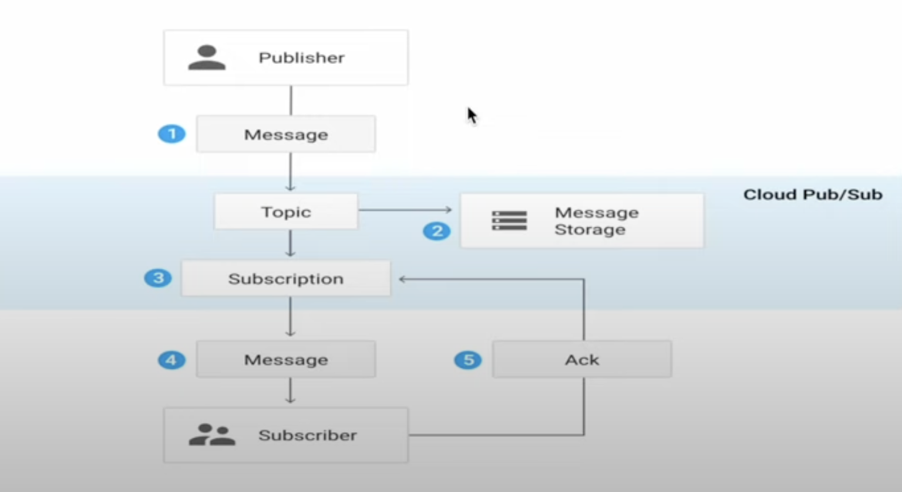
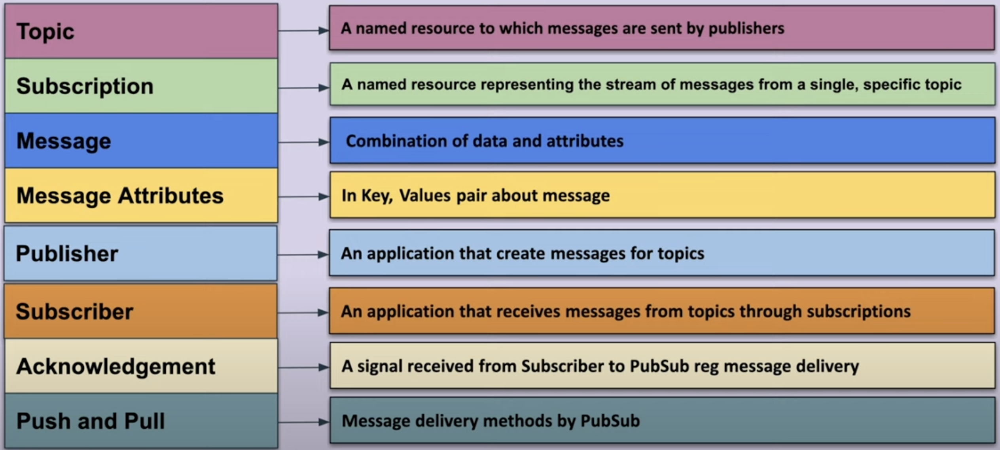
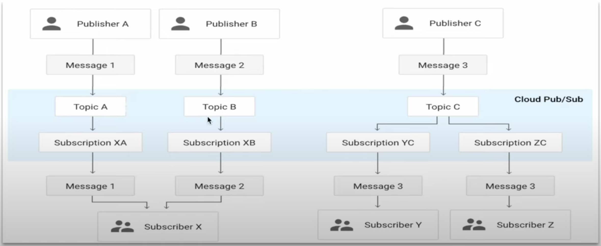
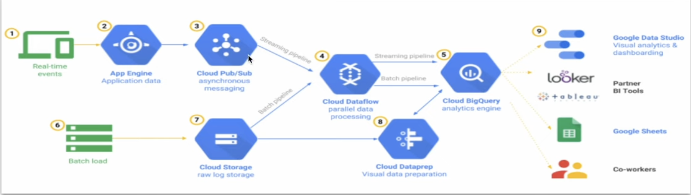
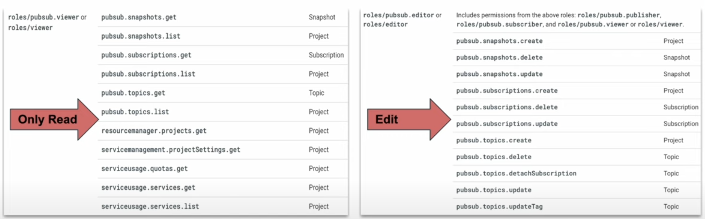
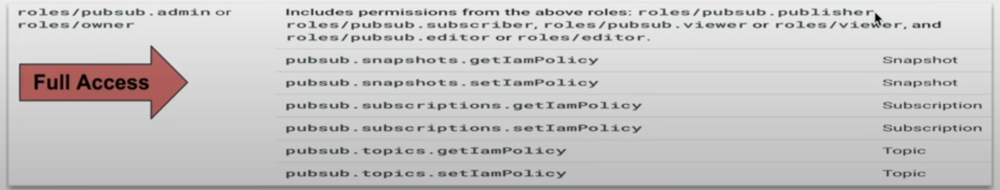
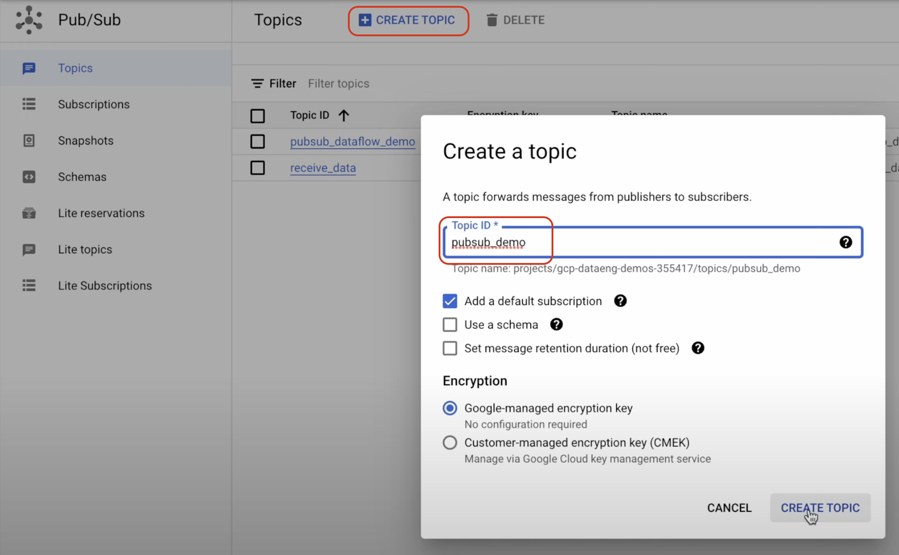

# Pub/Sub Introduction
Its a Messaging Service.

Pub/Sub allows service to communicate asynchronously, enables us to create systems of event producers and consumers, called Publishers and Subscribers.

Publishers communicate with Subscribers asynchronously by broadcasting events, rather than by synchronous Remote Procedure Calls (RPCs).

# Pub/Sub Core-Concepts & Terminologies

# Relationship 
Publisher-Subscriber relationship can be one-to-many (fan-out), many-to-one (fan-in), and many-to-many.

# Pub/Sub Use Case
1. Real-Time stream data ingestion from applications and IoT devices.
2. Parallel processing and workflows, multiple tasks can be executed through Cloud Functions.
3. Enterprise eventbus for sharing events acorss organization.
4. Replicate data among databases.

# Example - Architecture

# Permissions required for Pub/Sub

# Demo From Console
Create a Pub/Sub Topic from Console.
    Set the Topic ID as shown in screenhot, and rest remain default.
    

# Demo using Cloud Shell
Connect to Cloud Shell, and run below commands.
    
1. Create Pub/Sub Topic using CLI

    `gcloud pubsub topics create pubsub_demo_cli_431`

2. Create Subscription 
    
    `gcloud pubsub subscriptions create pubsub_demo_subs_cli --topic=pubsub_demo_cli_431`

3. Publish message to Topic

    `gcloud pubsub topics publish pubsub_demo_cli_431 --message="Hello, Hi how?"`

4. Receive the message 

    `gcloud pubsub subscriptions pull pubsub_demo_cli_431 --auto-ack`