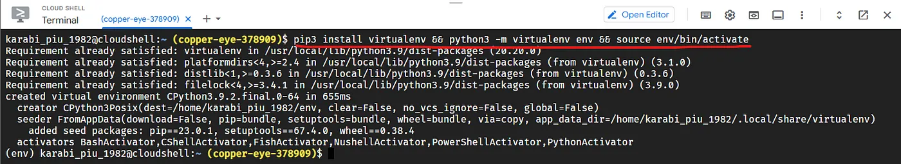
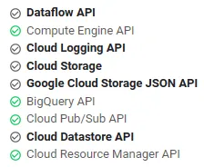
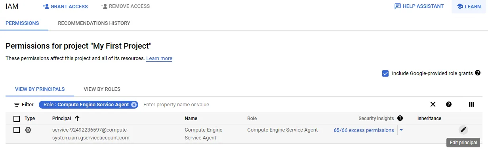
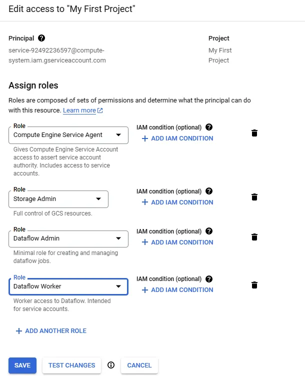
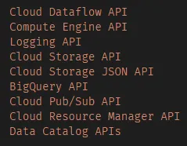

# Cloud Dataflow

# What is Cloud Dataflow?
[Official Doc](https://cloud.google.com/dataflow/docs/overview)

Cloud Dataflow is a Google Cloud service that offers unified batch and stream data processing at scale. It allows users to create data pipelines that read from multiple sources, transform the data, and write it to a destination.

(Unified model, is for defining both batch and streaming pipelines.)

Dataflow is a fully managed streaming analytics service that minimizes latency, processing time, and cost through autoscaling and batch processing.

Dataflow is designed to support batch and streaming pipelines at large scale. Data is processed in parallel, so the work is distributed across multiple VMs. Dataflow can autoscale by provisioning extra worker VMs, or by shutting down some worker VMs if fewer are needed.

As a fully managed (that's serverless), fast, and cost-effective data processing tool used with Apache Beam, Cloud Dataflow allows users to develop and execute a range of data processing patterns, Extract-Transform-Load (ETL), and batch and streaming.

Google Cloud Dataflow is a fully managed (serverless), cloud-based data processing service provided by Google Cloud Platform (GCP) which allows developers to create, test, and deploy data processing pipelines quickly and easily.

Dataflow can be used for batch processing, streaming processing, or a combination of the two. It is built on Apache Beam, an open-source unified programming model for batch and streaming data processing.

# Use Cases of Google Cloud Dataflow
1. **Real-Time Analytics**: Perform real-time analytics on streaming data, extracting insights and patterns as data arrives.
2. **ETL (Extract, Transform, Load)**: Ingest, transform, and load data from various sources into a target data store for analysis.
3. **Data Enrichment**: Enrich streaming or batch data with additional information from external sources, such as APIs or reference datasets.
4. **Fraud Detection**: Analyze transaction data in real-time to detect fraudulent activities and anomalies.
5. **Clickstream Analysis**: Analyze user clickstream data to gain insights into user behavior and website performance.
6. **Log Analysis and Monitoring**: Process logs from applications, servers, and devices in real-time to identify issues and troubleshoot problems.
7. **IoT Data Processing**: Process and analyze data from IoT devices, sensors, and connected devices in real-time.
8. **Recommendation Engines**: Build recommendation systems that provide personalized recommendations to users based on their preferences and behavior.
9. **Market Basket Analysis**: Analyze customer purchasing behavior to identify associations between products for cross-selling and upselling.
10. **Data Quality and Cleansing**: Cleanse and validate data in real-time or in batches to ensure data quality and accuracy.

# Feature of Google Cloud Dataflow
1. **Unified Model**: Dataflow provides a unified programming model for both batch and stream processing, simplifying development and reducing code duplication.
2. **Auto-Scaling**: Dataflow automatically scales up or down based on the processing requirements, ensuring optimal resource utilization and performance.
3. **Managed Service**: It’s a fully managed service, which means Google handles infrastructure provisioning, monitoring, and maintenance.
4. **Windowing**: For stream processing, Dataflow supports windowing, allowing you to group and analyze data within specific time intervals.
5. **Exactly-Once Processing**: Dataflow offers exactly-once processing semantics, ensuring that data is processed reliably without duplication or loss.
5. **Integration**: Seamlessly integrates with other Google Cloud services like BigQuery, Pub/Sub, Cloud Storage, and more.
6. **Flexible Sinks and Sources**: Supports various data sources and sinks, making it easy to ingest and export data to/from different systems.
7. **Monitoring and Logging**: Provides comprehensive monitoring, logging, and debugging tools to help you understand and optimize your data pipelines.
8. **Custom Transformations**: You can create custom transformations and functions to perform complex data processing.
9. **Templates**: Dataflow allows you to create reusable templates for common processing patterns, simplifying pipeline deployment.

# Google Cloud Dataflow Works and Architecture
Google Cloud Dataflow processes data using a directed acyclic graph (DAG) of transformations. 

Dataflow’s architecture abstracts much of the complexity of distributed data processing, allowing you to focus on defining your processing logic and transformations. Under the hood, it uses Google’s internal data processing technology to efficiently manage resources and deliver reliable processing capabilities.

Dataflow uses a data pipeline model, where data moves through a series of stages. Stages can include reading data from a source, transforming and aggregating the data, and writing the results to a destination.

Pipelines can range from very simple to more complex processing.

For more details [click here](https://cloud.google.com/dataflow/docs/overview#:~:text=Dataflow%20uses%20a%20data%20pipeline,simple%20to%20more%20complex%20processing.)

# How to Install Google Cloud Dataflow?
To install Google Cloud Dataflow, you will need to:

1. Create a Google Cloud Platform project and enable the Dataflow API.
2. Install the Apache Beam SDK for your programming language.
3. Create a Cloud Storage bucket to store your data and output files.
4. Write your Dataflow pipeline code.
5. Submit your Dataflow pipeline to the Dataflow service.

# Limitations
[Refer](https://cloud.google.com/dataflow/quotas)

# Execution on various engines / runner
* Direct Runner --> Usually recommended for local testing.
* Apache Spark
* Apache Flink
* DataFlow Runner

# Setup
1. Install Apache Beam
    To install apache beam either use the command `pip install 'apache-beam[gcp]'` or refer to [Official Document](https://cloud.google.com/dataflow/docs/guides/installing-beam-sdk#python)

    Optional: 
    Install the virtualenv module, create a virtual environment, and then activate it.
    

    Followed by Install the Apache Beam SDK

    `pip install wheel`
    `pip3 install apache-beam[gcp]`

    if fails...
    `pip3 install -U pip`
    `pip3 install -U setuptools`

2. Enable APIs
Enable the following APIs on your Google Project

Add the necessary IAM roles to the Compute Engine default service account

Add the following roles to your compute engine service account so that it can manage and execute dataflow jobs & can write the outputs to the storage bucket.

3. Create a bucket where you want your outputs to be saved.

# Use Case / Example 
## Example 01 - Word Count
Run an example pipeline in Dataflow as a job
A common example pipeline that comes with Apache Beam is WordCount, which counts the unique words in an input text file—in this case, Shakespeare's King Lear.

In Cloud Shell, use python to execute the WordCount pipeline on Dataflow as a job:

        python3 -m apache_beam.examples.wordcount \
        --region us-central1 \
        --input gs://dataflow-samples/shakespeare/kinglear.txt \
        --output gs://dataflow-apache-quickstart_copper-eye-378909/results/output \
        --runner DataflowRunner \
        --project copper-eye-378909 \
        --temp_location gs://dataflow-apache-quickstart_copper-eye-378909/temp/

5. Clean up
Deactivate the virtual environment by running the following command on cloud shell
    `deactivate`

## Example 02 — Use Dataflow SQL to join streaming data from Pub/Sub against BigQuery lookup table
**Enable APIs**
Enable the following APIs on your Google Project

**Create a Pub/Sub topic**
    `gcloud pubsub topics create transactions`

**Assign a schema to your Pub/Sub topic**
Assigning a schema lets you run SQL queries on your Pub/Sub topic data. Currently, Dataflow SQL expects messages in Pub/Sub topics to be serialized in JSON format.

Create a local file [transactions_schema.yaml](/GCP/Dataflow/streaming/01_Example/transactions_schema.yaml).

        gcloud data-catalog entries update \
            --lookup-entry='pubsub.topic.`project-id`.transactions' \
            --schema-from-file=path-to-file/transactions_schema.yaml
Validate if the setup was done correctly —

    `gcloud data-catalog entries lookup ‘pubsub.topic.`project-id`.transactions’`

**Create a new BQ table by uploading a local csv file**
Create a csv file [us_state_salesregions.csv](/GCP/Dataflow/streaming/01_Example/us_state_salesregions.csv).

**Create a BQ dataset**:

    `bq mk dataflow_sql_tutorial`

Create a new lookup table under your BQ dataset by uploading your CSV file:

        bq load --autodetect --skip_leading_rows=1 \
        --source_format=CSV dataflow_sql_tutorial.us_state_salesregions \
        "C:\Users\xyz\Downloads\us_state_salesregions.csv"

Create SQL query to join Pub/Sub transactions with BQ lookup table
The following SQL query is a data enrichment query. It adds an additional field, sales_region, to the Pub/Sub stream of events (transactions), using a BigQuery table (us_state_salesregions) that maps states to sales regions.

        SELECT tr.*, sr.sales_region
        FROM pubsub.topic.`project-id`.transactions as tr
        INNER JOIN bigquery.table.`project-id`.dataflow_sql_tutorial.us_state_salesregions AS sr
        ON tr.state = sr.state_code

Create a dataflow job to execute the above query and write the data to a BQ target table (sales)

        gcloud dataflow sql query 'SELECT tr.*, sr.sales_region FROM pubsub.topic.`copper-eye-378909`.transactions as tr INNER JOIN bigquery.table.`copper-eye-378909`.dataflow_sql_tutorial.us_state_salesregions AS sr ON tr.state = sr.state_code' --job-name dfsql-join-pubsub2bq --region us-central1 --bigquery-write-disposition write-empty --bigquery-project copper-eye-378909 --bigquery-dataset dataflow_sql_tutorial --bigquery-table sales --parameter ::

Ideally your dataflow job will start running within a few minutes. This job will subscribe to your topic and listen for any incoming messages. As soon as messages are published to your topic, it will join the topic data against the BQ look up table using your query and write the output to another BQ table (called sales)

Test your setup by publishing a few sample messages to your Pub/Sub topic
Once your dataflow job starts running, publish a few messages to your topic. Use the following command to publish a sample message:

        gcloud --project=copper-eye-378909 pubsub topics publish transactions --message='{\"tr_time_str\": \"2023-03-14 23:36:40\", \"first_name\": \"Tanika\", \"last_name\": \"Melia\", \"city\": \"Ashland\", \"state\": \"CO\", \"product\": \"Product 3\", \"amount\": 586.67}'

    