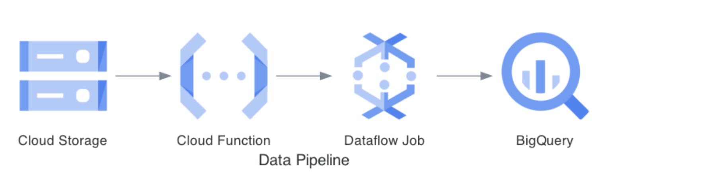

# Automating Data load from Google Storage to BigQuery
Requirement
* Upon the arrival of a CSV file in the GCS bucket, it should be loaded into BigQuery.

# Deploy all below via COnsole / Browser
1. Cloud Storage Bucket
    * mt_devops_bkt_01
    * Folder --> file(s) as below
        * metadata --> udf.js; bq_schema.json
        * landing_zone --> user.csv
2. Dataflow
    * Batch Job.