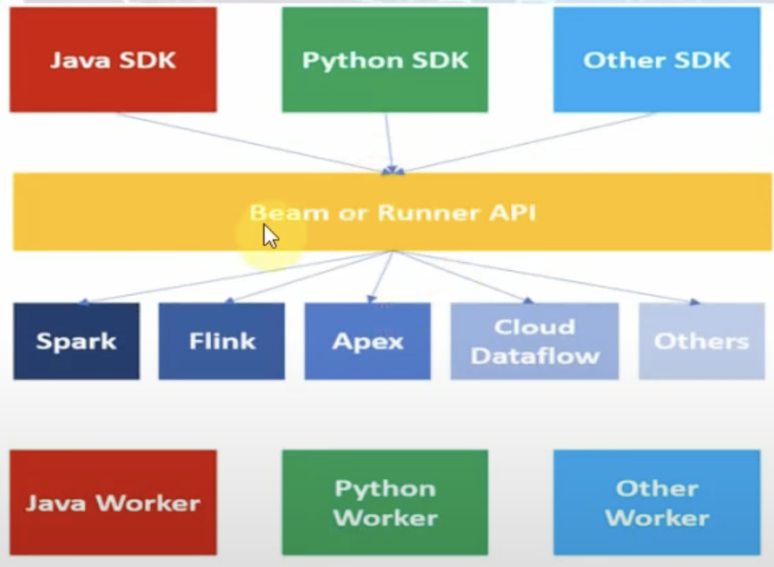

# Understanding the Dataflow using for Python

# Cloud Dataflow
Cloud Dataflow is fully managed service for creating and executing optimized parallel data processing pipelines.

This service will help you to deploy Batch and Streaming data processing pipelines via Apache beam.

# Apache Beam
Apache Beam is the open source project of apache is a Unified programming modelfor expressing efficient and portable big data processing pipelines.
Portable, beam pipeline once created in any language can be able to run on any execution frameworks like Spark; Flink; APEX; Cloud Dataflow etc.
Unified API to process both batch and streaming data.
    `Batch + strEAM = BEAM`

The Apache BEam Python SDK is an open source programming model for data pipelines. You define these pipelines with an Apache BEam progeam and can choose a runner such as dataflow-runner, to execute your pipeline.

Dataflow integrates with the Cloud SDK's gcloud command-line tool.
Horizontal autoscaling of worker resources to maximize resource utilization.
Jobs are created with predefined templates. There are many predefined templates provided by google itself https://cloud.google.com/dataflow/docs/guides/templates/provided-templates

# Architecture

# Demo
## Setup
Create Virtual Environment:
    `python3 -m venv .dataflow-env`

To start this I am using `.dataflow-env` as a virtual env.
To activate this navigate to the folder
    `cd Desktop/Apps/GitHub_Repo/GCP/Dataflow_Basics`
    `source .dataflow-env/bin/activate`

## Install 
`pip3 install wheel`
`pip3 install 'apache-beam[gcp]'`
If fails....
`pip3 install -U pip`
`pip3 install -U setuptools`

## Code
1. [Count All Elements](/GCP/Dataflow_Basics/count_allElements.py)
    This is a general python script, using the apache beam library.

    Test the Script `python3 count_allElements.py`

# PCollection in Apache Beam
A PCollection is a data set or data stream. The data that a pipeline processes is part of a PCollection.

It is an abstraction represents potentially distributed, multi-element data set. it represents a districbuted data set that our beam pipeline operates on.

* Immutability
* 