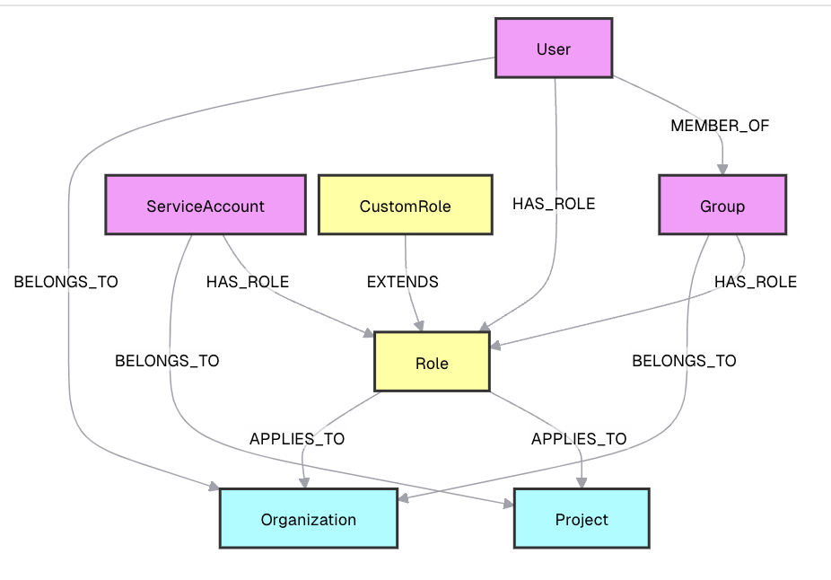

I'll design a Neo4j database and graph structure to track all existing GCP IAM (Identity and Access Management) components, including roles, custom roles, users, groups, service accounts, and their role bindings, along with their previous and current status. This design will help you visualize and query the complex relationships within your GCP IAM setup.

Let's break down the design:

1. Node Types (Labels):

1. User
2. Group
3. ServiceAccount
4. Role
5. CustomRole
6. Project
7. Organization


2. Relationships:

1. (User)-[:MEMBER_OF]->(Group)
2. (User)-[:HAS_ROLE]->(Role)
3. (Group)-[:HAS_ROLE]->(Role)
4. (ServiceAccount)-[:HAS_ROLE]->(Role)
5. (CustomRole)-[:EXTENDS]->(Role)
6. (Role)-[:APPLIES_TO]->(Project)
7. (Role)-[:APPLIES_TO]->(Organization)
8. (User)-[:BELONGS_TO]->(Organization)
9. (Group)-[:BELONGS_TO]->(Organization)
10. (ServiceAccount)-[:BELONGS_TO]->(Project)


3. Properties:

1. User: id, email, displayName, status
2. Group: id, name, description, status
3. ServiceAccount: id, email, displayName, status
4. Role: id, title, description, stage
5. CustomRole: id, title, description, stage
6. Project: id, name, projectNumber, status
7. Organization: id, name, domain, status
8. HAS_ROLE relationship: assignedAt, status


4. Tracking historical data:
To track historical data, we'll use a time-based approach with the HAS_ROLE relationship. We'll create a new HAS_ROLE relationship each time a role is assigned or changed, with a timestamp and status.


Now, let's create a Mermaid diagram to visualize this structure:




Now, let's provide some Cypher queries to demonstrate how to create and query this graph structure:

1. Creating nodes:


```sql
// Create a User
CREATE (u:User {id: "user1", email: "user1@example.com", displayName: "User One", status: "ACTIVE"})

// Create a Group
CREATE (g:Group {id: "group1", name: "Developers", description: "Development team", status: "ACTIVE"})

// Create a Service Account
CREATE (sa:ServiceAccount {id: "sa1", email: "sa1@project.iam.gserviceaccount.com", displayName: "Service Account 1", status: "ACTIVE"})

// Create a Role
CREATE (r:Role {id: "roles/editor", title: "Editor", description: "Edit access to all resources", stage: "GA"})

// Create a Custom Role
CREATE (cr:CustomRole {id: "projects/myproject/roles/customEditor", title: "Custom Editor", description: "Customized edit access", stage: "ALPHA"})

// Create a Project
CREATE (p:Project {id: "my-project", name: "My Project", projectNumber: "123456789", status: "ACTIVE"})

// Create an Organization
CREATE (o:Organization {id: "12345", name: "My Org", domain: "example.com", status: "ACTIVE"})
```

2. Creating relationships:
```sql
// User is a member of a Group
MATCH (u:User {id: "user1"}), (g:Group {id: "group1"})
CREATE (u)-[:MEMBER_OF]->(g)

// Assign a Role to a User
MATCH (u:User {id: "user1"}), (r:Role {id: "roles/editor"})
CREATE (u)-[:HAS_ROLE {assignedAt: datetime(), status: "ACTIVE"}]->(r)

// Custom Role extends a Role
MATCH (cr:CustomRole {id: "projects/myproject/roles/customEditor"}), (r:Role {id: "roles/editor"})
CREATE (cr)-[:EXTENDS]->(r)

// Role applies to a Project
MATCH (r:Role {id: "roles/editor"}), (p:Project {id: "my-project"})
CREATE (r)-[:APPLIES_TO]->(p)

// Service Account belongs to a Project
MATCH (sa:ServiceAccount {id: "sa1"}), (p:Project {id: "my-project"})
CREATE (sa)-[:BELONGS_TO]->(p)
```

3. Querying the graph:
```sql
// Find all Users with the Editor role
MATCH (u:User)-[:HAS_ROLE]->(r:Role {id: "roles/editor"})
RETURN u.displayName, u.email

// Find all Roles assigned to a specific User
MATCH (u:User {email: "user1@example.com"})-[hr:HAS_ROLE]->(r:Role)
RETURN r.title, hr.assignedAt, hr.status

// Find all Service Accounts in a specific Project
MATCH (sa:ServiceAccount)-[:BELONGS_TO]->(p:Project {id: "my-project"})
RETURN sa.displayName, sa.email

// Find all Custom Roles and their base Roles
MATCH (cr:CustomRole)-[:EXTENDS]->(r:Role)
RETURN cr.title AS CustomRole, r.title AS BaseRole

// Find all Groups a User belongs to
MATCH (u:User {email: "user1@example.com"})-[:MEMBER_OF]->(g:Group)
RETURN g.name, g.description
```

This Neo4j database and graph structure allows you to efficiently track and query all aspects of your GCP IAM setup, including historical data. You can easily extend this model to include more specific properties or relationships as needed for your use case.

